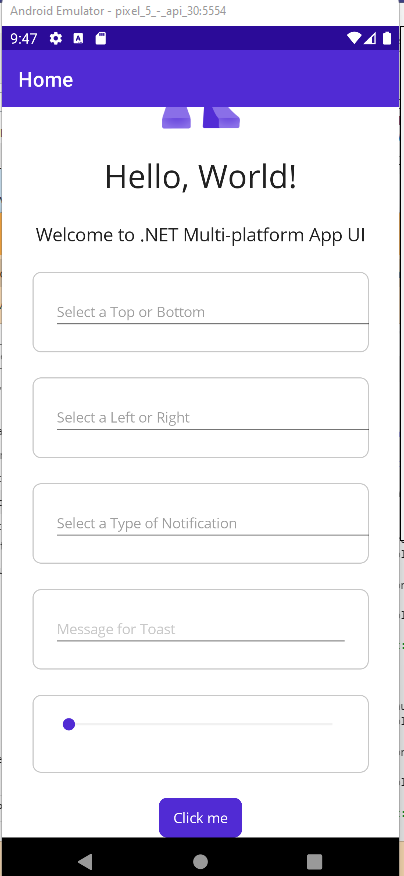
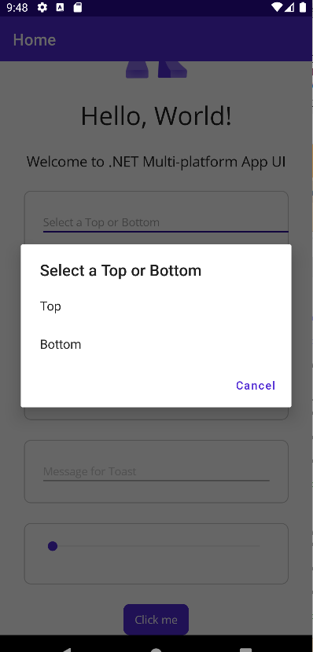
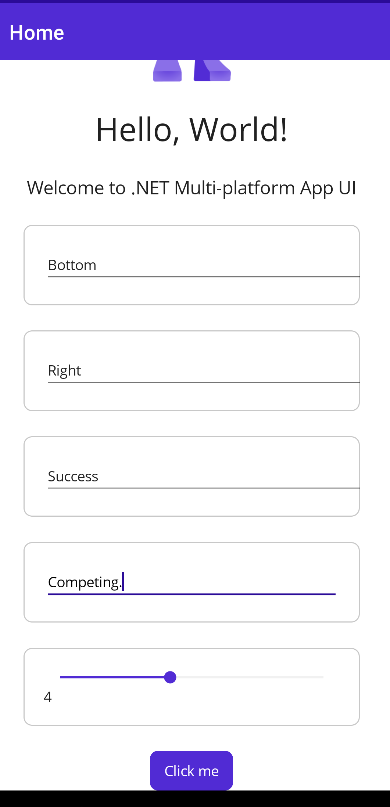
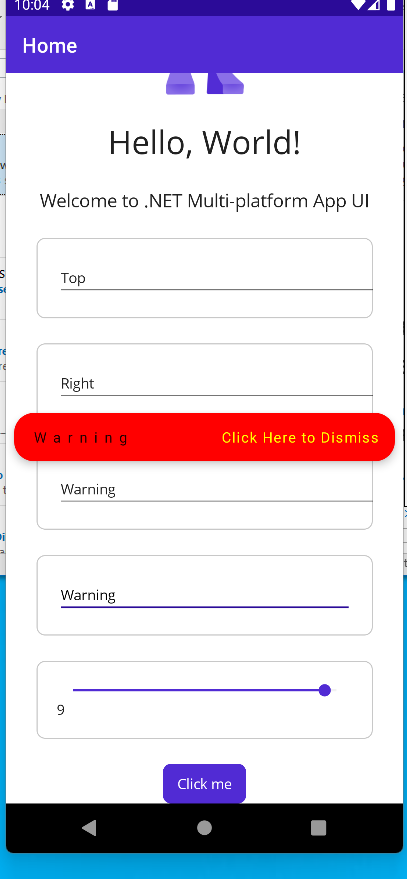
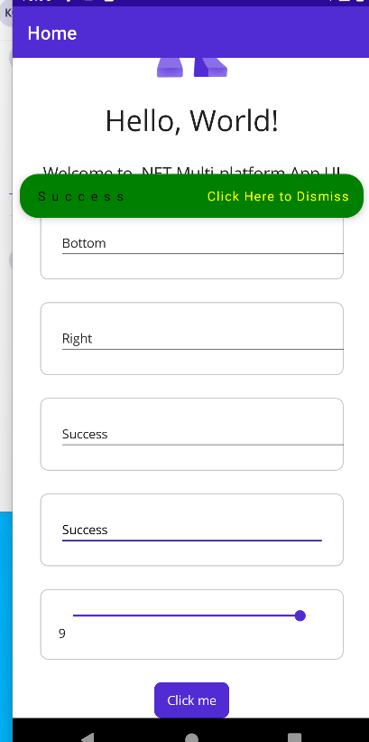

# ToastContest
-----------------------------------------------------
Hello US West Software Engineering TC!

Core Tech - May’s Coding Challenge is Toast Popup!

Core Tech’s coding challenge initiative encourages you to freshen up on your technical skills. This is a fantastic way to practice with new frameworks, prepare for interview questions, and engage with the SWE community!

Directions: 
1.	Carefully look at the Toast Popup example. 
2.	Using the tech stack/framework of your choice (React, Angular, Material UI, Bootstrap, etc.) , replicate the Toast Popup functionality.
3.	Once completed, send to @Greta Schock either format: 
a.	Your repository 
b.	A video recording of your project 

Note that there’s bonus points for stylization creativity! 
---------------------------------------------------------

Stack -  dotnet 7, Maui, Snackbar for alert.  Snackbar does not have capability to anchor in different areas of the app so we anchor it to a specific IVIEW.
First look at the app

Select some fields

Warning selected with popup anchored to a secific view.

Success in green also moved to a different location.
